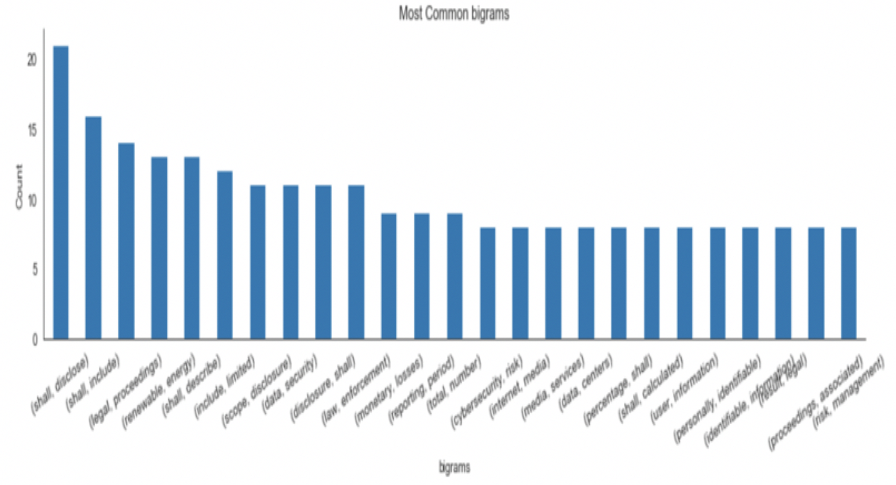
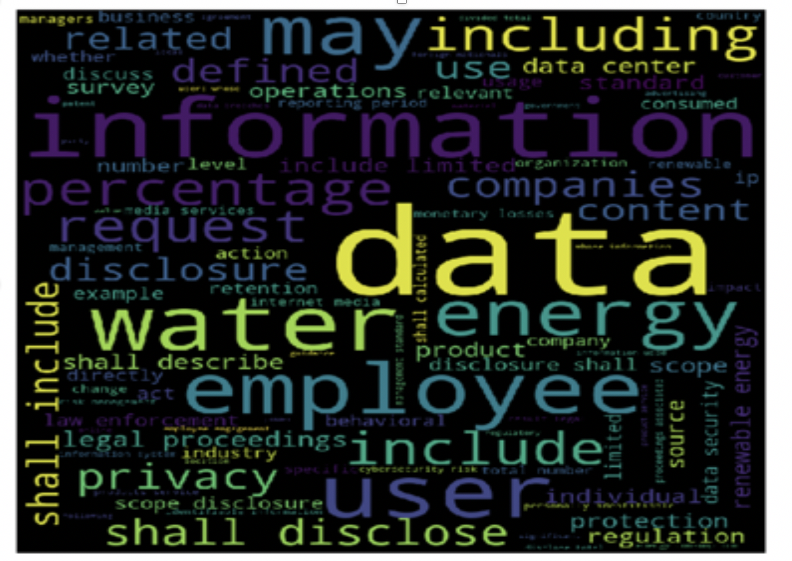
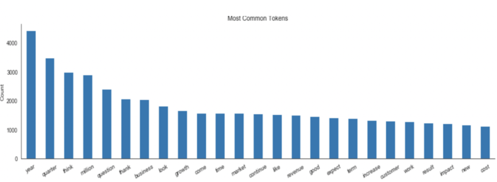
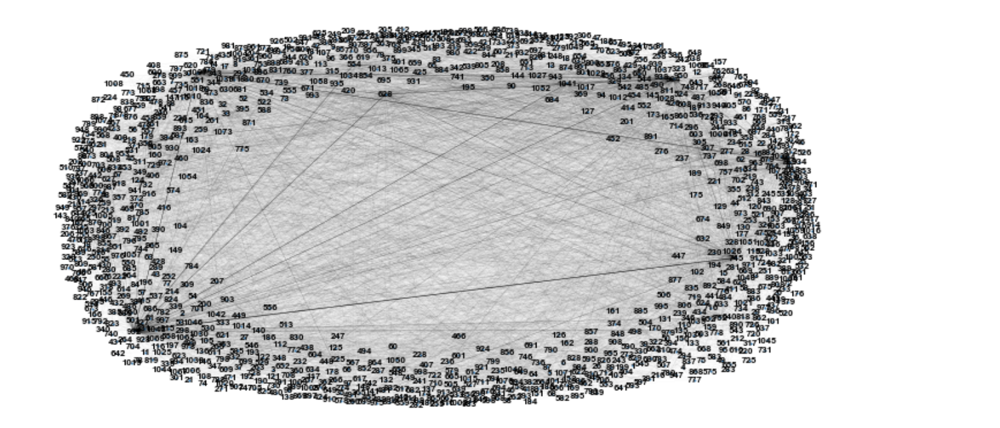

# Introduction

Earning Calls are one of the most important key resources of information on a company. Not only they are heavily used by investors and equity analysts to get insights on a company's fundamentals and earning estimates, But also they are used for creating trading strategies based on the its highlights.  

The traditional NLP methods for Exploratory Data Analysis typcially use Web scraping of HTML format of the transcripts followed by finding top bigrams Top bigrams indicate the phrases most frequently in the calls, Named Entity Recognition and Part of speech tagging to show the symatics of the calls. 

The general structure of an earnings call comprises of three sections which includes Safe harbor statement, Information on the company's financials and Q&A section.
The Earning calls discuss a number of topics ranging from company's operational results and financial statements for the period just ended and their outlook for the future. This is followed byb the Q&A During which investors, analysts, and other participants in the call have an opportunity to ask questions on financials of the company. The overall sentiment extracted from the earning calls gives an insight as to how to invest, analyse the position of the company.

How does the ESG fit into the earning calls? ESG stands for Environmental, Social and Governance and is increasingly being integrated along with other financial factors in the investment decision making process. ESG integrated strategies are very popular as they are used to access the sustainability and risks associated with the investment.[[1]](#ref1)

The purpose of this project is to answer three questions:   
1. Which NLP model is the best for sentiment factor extraction on Earning call transcripts?  
2. What are the trending topics discussed in the calls and are they related to the ESG industry specific standards as developed by SASB (Sustainability Accounting Standards Board)  
3. Can pre trained tranformer based Language models produce better sentiment analysis results than BiLSTM, CNN and SVM (baseline) models.  

### Futher Motivation : 
 
It is further possible that the sentiments for ESG based topics can reflect on the stock price movements of the company and trading strategies can be created using the predictions on the stock returns. The predictive power of the ESG factors on volatility and stock returns can be very advantageous in creating investing strategies and can compete with the relevance of other factors in doing so. It would be interesting to know if these strategies can beat benchmark trading strategies.
  
The owner of this project is  [Deepsha Jain](https://www.linkedin.com/in/deepsjai/) who is 2nd year Masters in Quantitative and computational Finance candidate at Georgia Tech.   

# Dataset
The Earning calls are txt files which had html tags from the SeekingAlpha website. There are 8,368 earning calls text transcript files which were parsed using Beautiful soup to extract just the text. The transcripts are unlabeled with are therefore used for unsupervised learning (topic modeling). The next step was to remove the website content which was not related to the transcript. That was done via regex such that the text only includes statements from the operator, speakers and Q&A.

The text still contained noise that was not required in preparing models. These involved lemmatized words, proper nouns (Named Entity), numerical data, punctuations etc. and too frequent words used in financial data that do not provide much information (For eg, years, quarter, days etc). To recognize such patterns, Exploratory Data Analysis was performed on the documents to further use them for topic modeling. The results of EDA and topic modleing will be discussed below.

Topic models are used to analyze large volumes of text. I have used Latent Dirichlet Allocation, or LDA based topic modeling which is popular in information retrieval field and widely used in search engines. LDA is a statistical machine learning which consist Clusters words into “topics”. It us a Bayesian inference model that associates each document with a probability distribution over topics, where topics are probability distributions over words.

Next is the word embeddings, there are several methods of creating the word embeddings. they are nothing but the numerical transformation of the texual data. However, keeping the context, position, meaning and the use case in mind, it becomes tremendously difficult to understand which text embedding should be used. The most basic ones is simply rule based bag of words. In this project, I have used Glove with 100 dimensions as it is consistent with BiLSTM and CNN models and takes less time for Text classification Task.

As an extenstion to this project I have used transformer based BERT model (specifically BFSC - BertForSequenceClassification). Similar to the concept of FINBERT, I have tried to run the model on SASB dataset as pre training and then used earning calls labeled data to fine tune the model. The pipeline of finbert is discussed in the further sections. 

For the supervised learning however, we wanted labeled that could be used in text classification task. The problem statement is that we are training our data on two class of datasets - one that is contains all the ESG related topics and other that is ESG neutral. The data related to ESG topics was taken from SASB dataset which was again categorized into industry specific standards. The details of SASB dataset have been dicussed below.

### Sustainability Accounting Standards Board

Sustainable Investing is the combination of traditional investment approaches with environmental, social and governance (ESG)
insights. According to the reasearch ESG factors, Classification of companies should be performed using ESG items material to their specific industry. These industries are Consumer Goods, Extractives & Mineral Processing, Financials, Food & Beverage, Health Care, Infrastructure, Renewable Resources & Alternative Energy
Resource Transformation,Services, Technology & Communications,Transportation labeling these standards as ESG positive and training on them to test whether earning calls can be labeled as ESG positive. Sentiment analysis can help classify earnings calls based on positive and negative sentiment on ESG factors for more nuanced uses.

# Data Insights

Top bigrams indicate that the phrases most frequently mentioned are related to ESG factors in SASB dataset (e.g. “renewable Energy’, ’GAAP financial’), and CEO compensations (e.g. ‘chief executive’, ‘based compensation’ ). The top 2 industries mentioned are Consumer and the IT industry.

   

Fig 1. Top bigrams and the word cloud for SASB datasets 

   

Fig 2. Top words and the word cloud for Earning calls data 

# Word Embeddings using Co-occurrence Matrix;

In order to get check the similarity between the words in use in the earnings calls, I made word embeddings based on the cooccurence of the words.The first step is creating  co-occurrence matrix for the given corpus and window_size. The corpus here are each document containing the earnings calls and Each word in a document should be at the center of a window and words near edges will have a smaller number of co-occurring word. I choose the window size = 4  as it is easy to compute.
The input to compute the word embeddings should be distinct words and The ordering of the words in the rows/columns should be the same as the ordering of the words given by the distinct words. The resulting co-occurrence matrix is a sparse matrix and thus the dimenstionality of the matrix needs to be reduced. For this I used Simple Value Decomposition (SVD), truncating  each word embedding to only 2 dimensions. 

In order to check the similarity of the sample words and plot the embedding. I used the group of words mentioned in the corpus and based on their co-occurrence plotted their embeddings. The following graph shows similarity of the words. 

   

Fig 3.  The plot shows the embeddings of a set of text in 2 dimensions and shows distance between them represents similarity.

The words in the document can also show connections with words as given in the bipartite graph below. Each number is the index of the word in the text and the edges have weight assigned to them based on the occurence of the word pair.

   

Fig 4.  The network graph connecting all the distinct text of a Earning call represented by their index.

# UnSupervised Learning : LDA - Latent Dirichlet Allocation

The latent Dirichlet Allocation is a generative probabilistic model that assumes each topic is a mixture over an underlying set of words, and each document is a mixture of over a set of topic probabilities. I have performed the following tasks for implementing. 
#### 1.) Exploratory analysis
After the preprocessing of the data, to know the contents and other information of the documents, The exploratory data analysis is done, the results of which are shown below 

#### 2.) Preparing data for LDA analysis:
Converting the documents into a simple vector representation using count vection from sklearn. and find out the most common word from the wprd cloud and plot it

#### 3.) LDA model training and Analyzing LDA model results:

 Training the LDA we get the following results:

# Supervised Learning : Text Classification

### Baseline Model

### BiLSTM
the model first creates an embedding vector for each word from an embedding dictionary generated from glove word embeddings. The words which are not found in the embedding dictionary have zeros in all the dimensions. The embedding dimension of each word = 100. Following are the layers in BiLSTM.

· Embedding layer

· 3 Hidden layers: These 3 bidirectional LSTM layers with recurrent dropout = 0.2

· Dropout layer which is a type of regularization to prevent overfit. This masks a certain portion of the output from each hidden layer so that the model does not train on all the nodes and overfit.

· Fully connected dense layer at the end with 256 neurons and Relu activation

· Finally, the output layer with Softmax activation to probability since we have 2 classes

· Since the word embedding is a sparse vector. And it’s a classification problem, the loss function used is “sparse_categorical_crossentropy” with Adam optimizer.

### CNN

1D convolution neural nets are also use for sentiment analysis task. The model can be made deeper by doing a character level classification to increase performance but they computationally expensive. I have tried token level classification with the following layers.

· Embedding layer: similar to biLSTM one

· Initial dropout layer with a dropout of 0.2

· Conv1D layer with size of 64 features of size 3 and no. of strides = 1

· Maxpooling layer and 2 Dense connected layers with Relu Activation

· the output layer with Softmax activation to probability

· Back propagation same as in BiLSTM

Accuracy: 91.04*

### other model variants : CNN with LSTM
Another variant is a Hybrid model that is the combination of CNN and LSTM model. This was implemented from [3] and hybrid framework of the model includes the 1D Convolutional layer followed by Maxpool layer and then the LSTM layer. This model Variant uses CNN to capture local Context of the data which is easier to compute with the CNN model

and LSTM to capture historical information form the sentences which cannot be saved in case of the CNN. It combines the above two models.

LSTM with attention: Attention is new extension used in RNN models to resolve their limitations of bottleneck in the context vector n Sequence to sequence model, (mostly for Machine Translation). Several studies suggest BiLSTM with attention mechanism has greater accuracy than CNN. As mentioned in [2], Attention considers weighted average of all the word embeddings in the context vector and thus in turn adds more weight to the ones that are more appropriate to be used. This is commonly used in BERT models in LSTM encoders and decoders.

I used the same BiLSTM model in 1. Extending it to add attention layer to it. However, the accuracy did not change.

### Model details
freq_ae_model

### Loss function
An RMSE reconstruction loss is used to train the model. This model effectively penalizes large errors, with less weight given to small deviations. As seen in the next section, this directly optimizes for our evaluation metric.

### Compression Evaluation Metric
Music is fundamentally subjective. Thus generating a quantitative evaluation metric for our compression algorithm is very difficult. It is not possible to naively compare the reconstructed time domain signals, as completely different signals can sound the same. For example, phase shift, or small uniform frequency shifts are imperceptible to the human ear. A naive loss in the time domain would heavily penalise this.

# Transfer Learning

### BERT

### FINBERT

We train a FinBert model based on BertForSequenceClassification(BFSC) model, which is built on BERT(Bidirectional Encoder Representations from Transformers) with an extra linear layer on top. To capture the ESG sentiments, we perform transfer learning and fine-tune the BFSC model using the labeled dataset we used in our supervised learning and then predict the sentiment for the testing t in our news data set.

### Model details
freq_ae_model

### Loss function
An RMSE reconstruction loss is used to train the model. This model effectively penalizes large errors, with less weight given to small deviations. As seen in the next section, this directly optimizes for our evaluation metric.

### Compression Evaluation Metric
Music is fundamentally subjective. Thus generating a quantitative evaluation metric for our compression algorithm is very difficult. It is not possible to naively compare the reconstructed time domain signals, as completely different signals can sound the same. For example, phase shift, or small uniform frequency shifts are imperceptible to the human ear. A naive loss in the time domain would heavily penalise this.

### RMSE Loss

Time-Domain Autoencoder
Our main motivation for this approach is to build an end-to-end network so that it can potentially learn a more compressed representation. This approach is inspired from computer vision where people moved from a classical pipeline of feature design to end-to-end deep models.

Learning on a time domain signal saves space too as the spectral domain of an audio signal is sparse. We can directly go to a more efficient representation right after the first layer.

Model Details
time_domain_autoencoder

Loss functions
Even though an RMSE loss in the time domain is not the best choice from a point of view of audio perception, we found that it worked better than loss computation in spectral or log-spectral domain.
# Conclusion 
_______

# References

 1.	ESG2Risk: A Deep Learning Framework from ESGNews to Stock Volatility Prediction, Tian Guo.   
 2. Distributed Representations of Words and Phrases and their Compositionality  
 2. Text classification based on hybrid CNN-LSTM hybrid model, Xiangyang She   
 2. Attention Is All You Need, Ashish Vaswani    
 2. FinBERT: Financial Sentiment Analysis with Pre-trained Language Models, Dogu Tan Araci    
